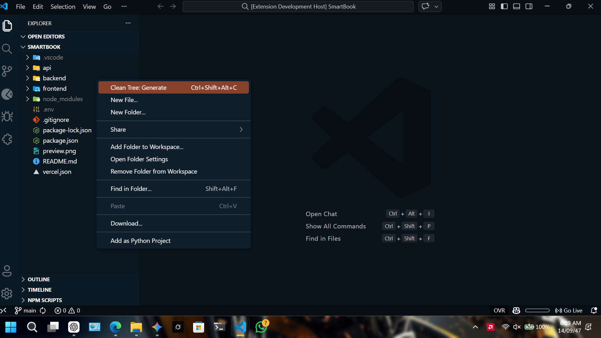
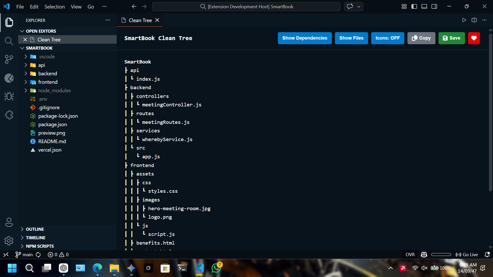
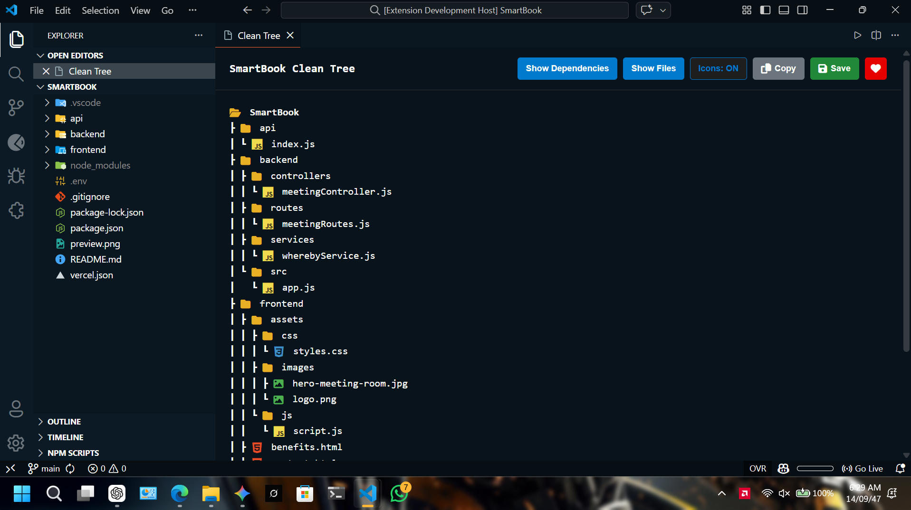
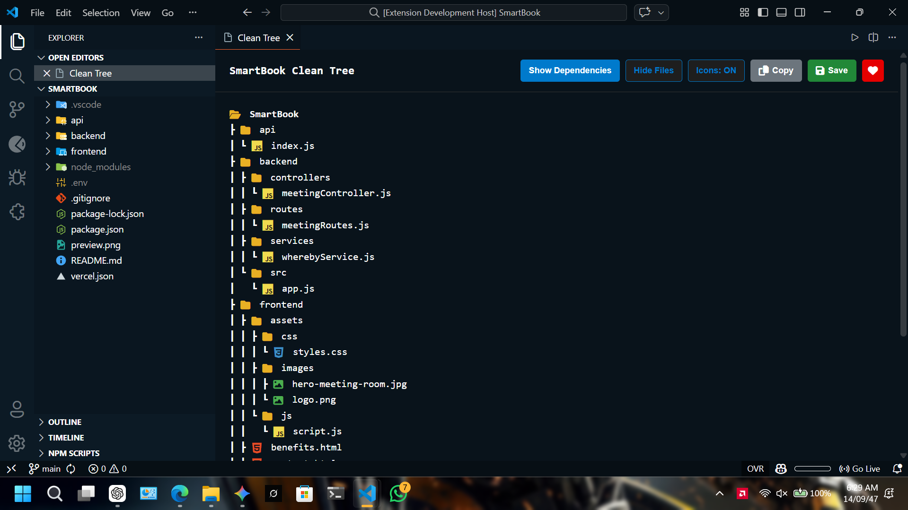
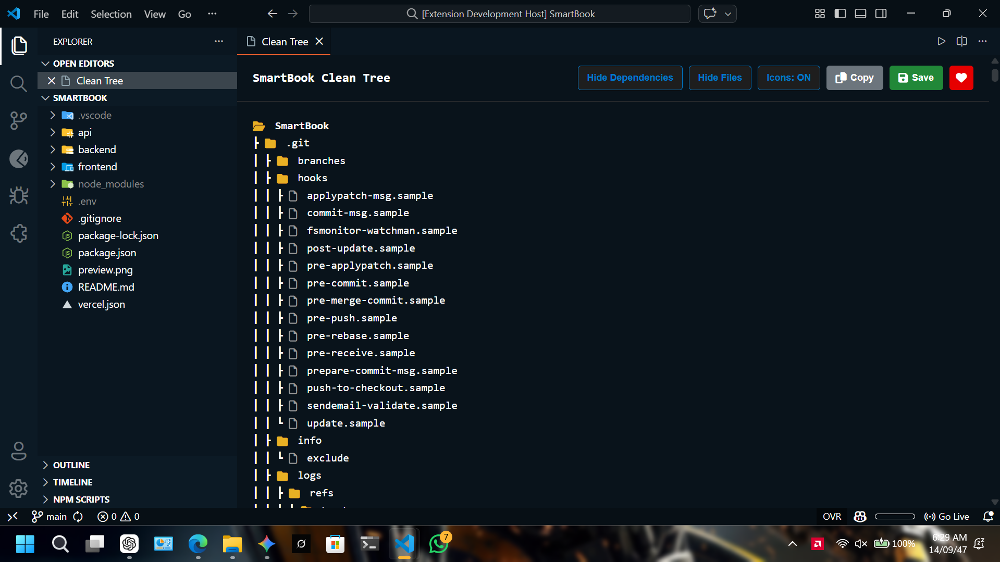

  
  
  # 🌳 Clean Tree
  
  
  

**A high-performance VS Code extension designed for developers who need to visualize and share project structures without the noise.**

---

## 🎥 See it in Action

<video src="images/sample.mp4" width="100%" controls autoplay loop muted></video>

---

## ✨ Key Features

- **Interactive Webview Panel:** View your tree in a dedicated, high-fidelity UI tab.
- **Smart Folder Grouping:** Automatically pushes folders to the top and files to the bottom, just like the native VS Code explorer.
- **Intelligent Filtering:** Instantly toggle off `node_modules`, `.git`, `dist`, `venv`, and other dependency clutter.
- **Developer Icons:** Built-in support for **DevIcons** and **FontAwesome**, giving your tree a professional, modern look.
- **One-Click Export:** Save your cleaned-up tree directly to a `.txt` file for documentation or READMEs, or copy it straight to your clipboard.
- **Persistent State:** Your toggle preferences (Icons, Folders, Files) are saved across sessions!

---

## 📸 Visual Tour

Here is a closer look at what Clean Tree can do:

---

## 🚀 How to Use

1. **Open a Project:** Open any folder in VS Code.
2. **Generate Tree:** \* Right-click any folder in the Explorer and select **Clean Tree: Generate**.
   - OR use the shortcut: `Ctrl+Shift+Alt+C` (Windows/Linux) or `Cmd+Shift+Alt+C` (Mac).
3. **Customize:** Use the controls at the top of the webview to customize your output.
4. **Save/Copy:** Click the **Save** button to export your tree to your project root, or hit **Copy** to paste it anywhere.

---

## 🛠️ Built With

- [TypeScript](https://www.typescriptlang.org/) - Core Extension Logic
- [VS Code Extension API](https://code.visualstudio.com/api) - Integration
- [FontAwesome](https://fontawesome.com/) & [DevIcons](https://devicon.dev/) - Visual Styling

---

## 👨‍💻 About the Author

**Hashir Sajid**

"Hi, I'm Hashir! 👋 I'm passionate about building tools that make developers' lives easier. If you find this extension helpful in your workflow, I'd love to connect with you!"

- **GitHub:** [@hashirsajid58200p](https://github.com/hashirsajid58200p)
- **LinkedIn:** [linkedin.com/in/hashirsajid](https://www.linkedin.com/in/hashirsajid)

---

  <em>Created with ❤️ by Hashir Sajid</em>

